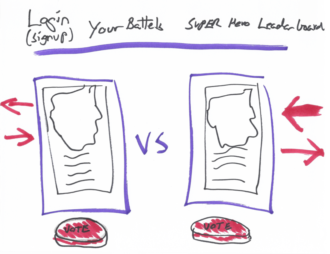
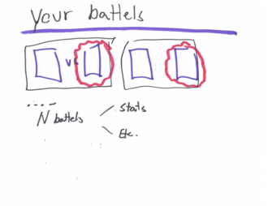
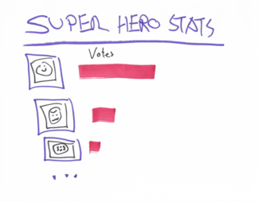

  # Project Title: Superhero Mashup 
  ### [](https://opensource.org/licenses/Apache-2.0)
  
  ## Table of contents:
  1. [Title](#Project-Title)
  1. [License](#License)
  1. [Project Description](#Project-Description)
  1. [Installation](#Installation-Instructions)
  1. [Useage](#How-To-Use)
  1. [How to Contribute](#How-to-Contribute)
  1. [Test Instructions](#Test-Instructions)
  1. [Questions](#Questions)

  ## License: 
  ### This project is licensed under Apache 2.0 License (click on icon near the top):
  or here: [Apache 2.0 License](https://opensource.org/licenses/Apache-2.0)
 

  ## Project Description:
  Game for Matching Super Heros and keeping stats.

  ### User Story:
  ```
  AS A Super Hero Fan\
  I WANT USERS to Compare Super Heros so we can determine once and for all who the best super hero is\

  WHEN I log in\
  THEN I am presented with two super heros, for which i can cast a vote (using a big red button)\
  WHEN I vote for one of the superheros\
  THEN The winning Hero gets a point AND the loosing hero is removed in a dramatic way.\
  THEN the winning super hero is matched with a new hero and the game continues\
  WHILE i am logged in I have access to my homepage where I can see how I voted on previous matches. (OPTION stats by superhero universe etc can be added).
  WHILE I am logged in I have access to a super hero leader board where i can see a ranking of superheros by the number of votes they have received (OPTION sort the heros by superhero universe or other stats..).
  WHEN I loose network all my stats are still accessible, but the battle is now replaced by matches between Mozilla dino's with randomly generated superhero names.  
  ```
  ### See a mockup of the app below:
  
  
  


  ## Installation Instructions:
  deployed here ***TBA
  ## How To Use
  Login or sign up, join the game and watch the stats. 

  ## Stack
  * React frontend with CSS
  * Node Server running express
  * GraphQl API
  * Mongoose Object Mapper
  * MongoDB database 

  ## How to Contribute:
  * Play the game add to the stats :-)
  * Checkout the github repo and please raise any issues with Superhero mashup you come across 
  * Even better - help with bugfixes and features by submitting your solutions in pull requrets for the repo
  * Follow the code of coduct for contribution outlined in [Contributor Covenant](https://www.contributor-covenant.org/) 
  ## Test Instructions
  ### The testing strategy is as follows
  #### Test to be implemented

  ## Questions
  Feel free to reach out either in the projects GitHub page or send an email to the address below
  ### Github page:
  [GitHub](https://github.com/melissabarrerafarias/project-3)
  ### email:
  [allemails@here.com](mailto:allemails@here.com) 
