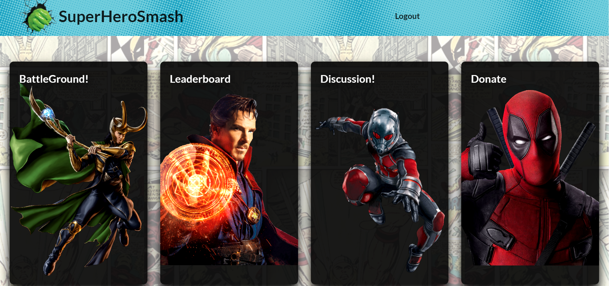
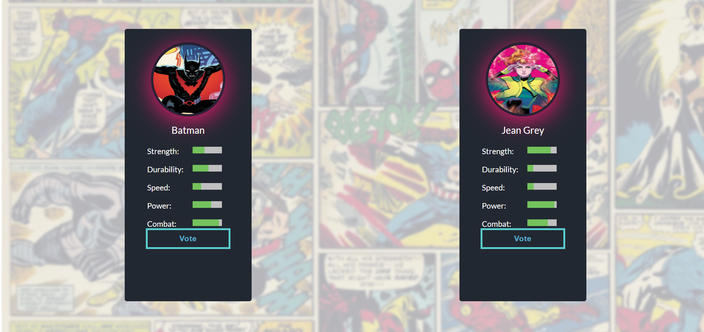
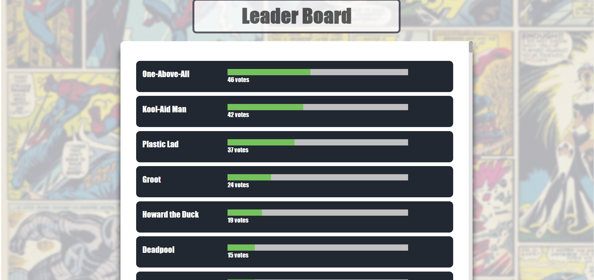
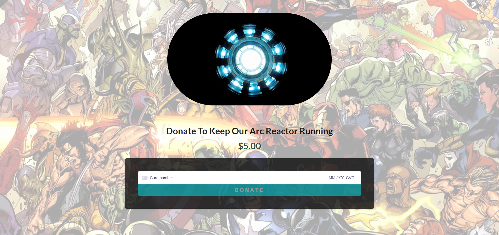

  # Project Title: SuperHeroSmash
  
  ## Table of contents:
  1. [Project Description](#Project-Description)
  1. [Installation](#Installation-Instructions)
  1. [Usage](#How-To-Use)
  1. [How to Contribute](#How-to-Contribute)
  1. [Questions](#Questions)

  ## Project Description:
  SuperHeroSmash is a social/entertainment application based around superheroes. Vote for your favorite heroes on the battleground and your vote gets added to the leaderboards! There you can see how your opinion is doing against other players! If you really want to make your opinion known or express your love for a certain hero... head over to the Discussion board and make your point known! The application is also available for download on desktop and mobile. Feel free to checkout our awesome arc reactor and help keep it running on the donate page!

  ### User Story:
  ```
  AS A super hero fan
  I WANT USERS to compare super heros so we can determine once and for all who the best super hero is\

  WHEN I log in or sign up
  THEN I am presented with the home page
  WHEN I click on the Battleground option
  THEN I am taken to the Battleground page and presented with two super heroes
  WHEN I vote for my personal favorite, my favorite hero persists and a new hero is chosen to battle
  WHEN I am done voting, return to the home page, and click on the LeaderBoard option
  THEN I am presented with all the superheroes players have voted for and the amount of votes for each player
  WHEN I click on a hero
  THEN I can see which players voted for those heroes
  WHEN I return to the home page and click on the Discussion option
  THEN I am presented with existing threads and the option to create a new one
  WHEN I click on an existing thread
  THEN I am taken to the discussion where I can view replies and leave one myself
  WHEN I return to the Discussion Board and create a new thread
  THEN my thread is added to the list of existing discussions
  WHEN I click 'My Threads'
  THEN I can view my own threads
  WHEN I click 'Delete' on one of my threads
  THEN that thread is removed from the app
  WHEN I return to the home page and click on the Donation option
  THEN I am presented with a photo of Tony Stark's Arc Reactor and invited to donate $5 to keep it running
  WHEN I try to navigate to a page that doesn't exist
  THEN I am shown a 404 error and prompted to return
  WHEN I choose to install the application
  THEN it is installed on my device with a small superhero logo
  WHEN I log out
  THEN I can no longer access certain sections of the application
  ```
  ### Here's what our app looks like!:
  
  
  
  
  
  ## Installation Instructions:
  [Click here to go to the deployed application](https://superherosmash.herokuapp.com/)
  ## How To Use
  Login or sign up, vote in the batteground and express your opinion on the discussion board! 

  ## Built With
  * React frontend with CSS (Semantic-UI)
  * Node Server running express
  * GraphQL
  * Mongoose ODM
  * MongoDB 
  * Stripe
  * JWT
  * Apollo-Server
  * Deployed on Heroku

  ## Made By
  Karl-Johan Westhoff

  Vladislav Tregubov

  Anji Ismail 

  Adam Barron

  Melissa Barrera
  

  ## How to Contribute:
  * Play the game, add to the leaderboards :-)
  * Checkout the github repo and please raise any issues with SuperHeroSmash you may come across 
  * Even better - help with bugfixes and features by submitting your solutions in pull requests for the repo
  * Follow the code of conduct for contribution outlined in [Contributor Covenant](https://www.contributor-covenant.org/) 

  ## Questions
  Feel free to reach out either in the projects GitHub page or send an email to us!
  ### Github page:
  [GitHub Repository](https://github.com/melissabarrerafarias/superherosmash)
  ### Contact Us:
  [Karl-Johan Westhoff](karl.johan.westhoff@gmail.com)

  [Vladislav Tregubov](vladislavtregubov00@gmail.com)

  [Anji Ismail](anjin.ismail@gmail.com)

  [Adam Barron](adambarron@me.com)

  [Melissa Barrera](melissabarrerafarias@gmail.com)
